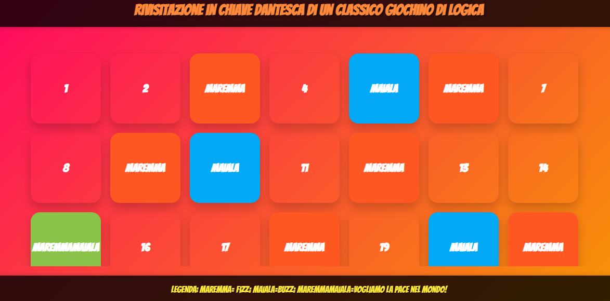

# 🎮 Rivisitazione Dantesca del FizzBuzz! 🧠💡

Benvenuti nella **rivisitazione Dantesca di un classico giochino di logica**! In questa versione speciale del FizzBuzz, abbiamo ravvivato l'esercizio con espressioni coloritedella tradizione TOSCANA. 🚀

## Come funziona il gioco? 🤔
- Se un numero è divisibile per **3**, stampa: **"Maremma"**.
- Se un numero è divisibile per **5**, stampa: **"Maiala"**.
- Se è divisibile per **3** e **5**, stampa: **"MaremmaMaiala"**! ✨🌍 (Siamo per la pace nel mondo 🌍✌️).

- ## Screenshot 📸
Ecco un'anteprima di come appare il gioco nel browser:

